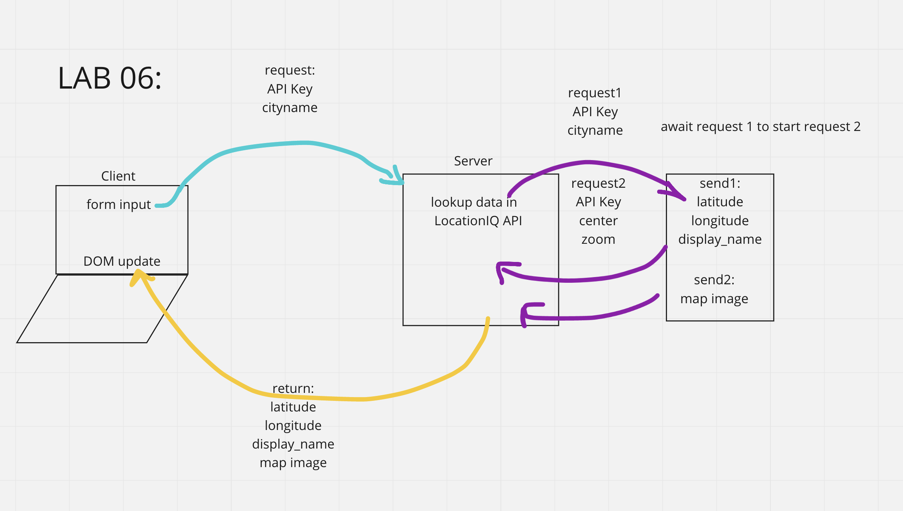
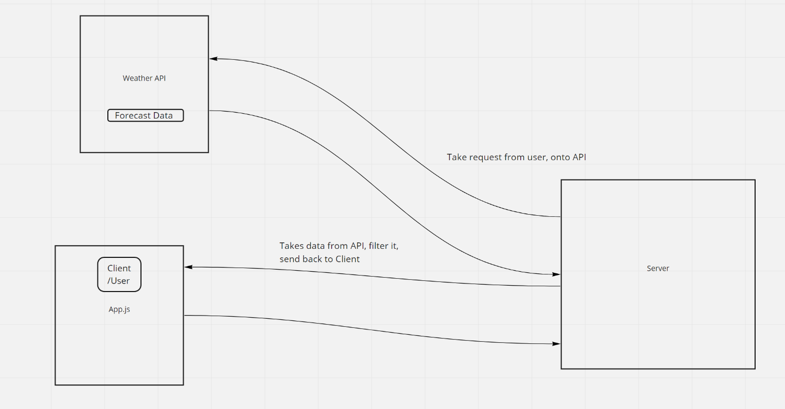
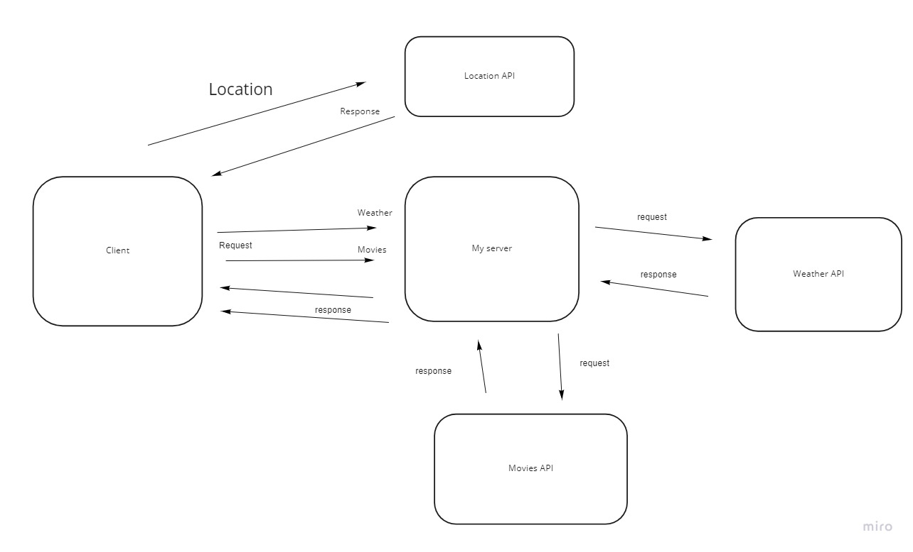

# city-explorer-api

**Author**: Michael Milsap
**Version**: 0.0.1 (increment the patch/fix version number if you make more commits past your first submission)

## Overview
Custom API server to provide data to my City Explorer app.
## Getting Started
<!-- What are the steps that a user must take in order to build this app on their own machine and get it running? -->
Created a seperate repo from my City Explorer app and used NPM to install express,dotenv,cors.

## Architecture
<!-- Provide a detailed description of the application design. What technologies (languages, libraries, etc) you're using, and any other relevant design information. -->
Express,dotenv,cors

## Change Log
<!-- Use this area to document the iterative changes made to your application as each feature is successfully implemented. Use time stamps. Here's an example:

01-01-2001 4:59pm - Application now has a fully-functional express server, with a GET route for the location resource. -->

12-10-2021 12:30am - Application talks to the backend and frontend locally and on netlify. Was able to make the code a bit mor emodular. Currently having issues with rendering a single set of Movie Data and Weather Data.

## Credit and Collaborations
<!-- Give credit (and a link) to other people or resources that helped you build this application. -->

# Time
Name of feature: City Explorer API

Estimate of time needed to complete: 4 Hours

Start time: 1530

Finish time: 2230

Actual time needed to complete: _____